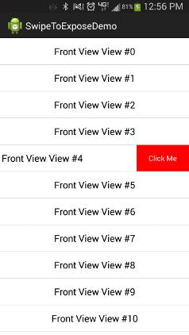

swipetoexpose-android
=====================

A library to enable swiping on ListView items, exposing a view behind each item

This was built for a specific project that needed to copy iOS swiping on listviews to expose a delete button. 
You may use any type of view you wish in the hidden layout, however, not using a button is recommended.

You will need to call setHiddenLayout() and setFrontLayout() on the SwipeExposeListView.

You can follow list_item_expose.xml in the demo to have a front and hidden layout.
